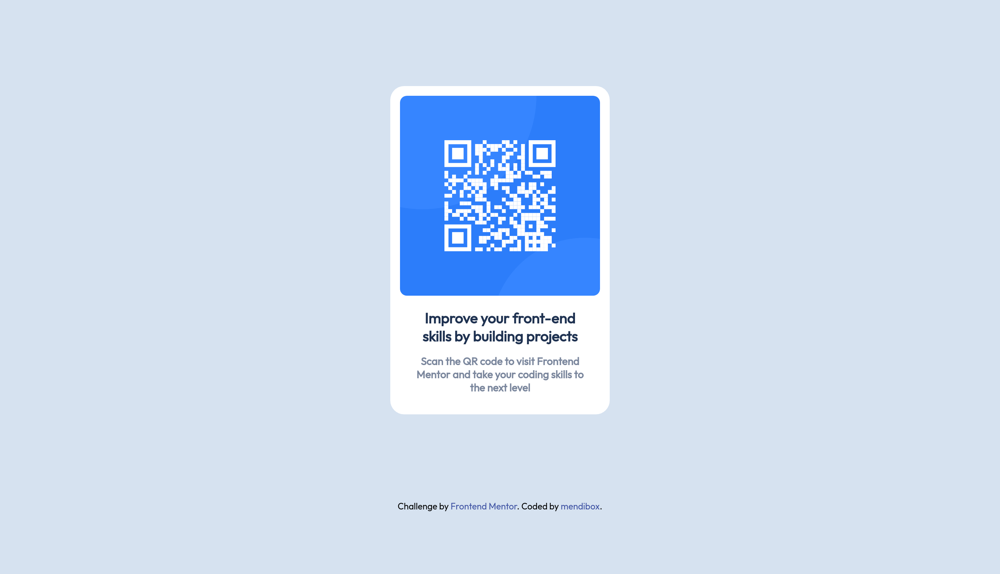

# Frontend Mentor - QR code component solution

This is a solution to the [QR code component challenge on Frontend Mentor](https://www.frontendmentor.io/challenges/qr-code-component-iux_sIO_H). Frontend Mentor challenges help you improve your coding skills by building realistic projects. 

## Table of contents

- [Overview](#overview)
  - [Screenshots](#screenshots)
  - [Links](#links)
- [My process](#my-process)
  - [Built with](#built-with)
  - [What I learned](#what-i-learned)
    - [HTML](#html)
    - [CSS](#css)
  - [Continued development](#continued-development)
  - [Useful resources](#useful-resources)
- [Author](#author)

**Note: Delete this note and update the table of contents based on what sections you keep.**

## Overview

The challenge is to display correctly a QR code component. The solution is optimized for devices 375px width and desktop devices 1440px width.

### Screenshots

### Links

- Solution URL: [Add solution URL here](https://www.frontendmentor.io/solutions/qr-code-component-peTeieZxSq)
- Live Site URL: [Add live site URL here](https://mendibox.github.io/QR/)

## My process

### Built with

- Semantic HTML5 markup
- CSS custom properties
- Mobile-first workflow

### What I learned

#### HTML

- Included the meta tag to make the solution responsive.
- How to add fonts from Google.

#### CSS

- CSS selectors.
- Relative and absolute lengths based on device viewport.
- Media queries.

### Continued development

I will keep learning more about responsiveness, concepts such as relative and absolute lengths are not clear enough.

## Author

- Frontend Mentor - [@mendibox](https://www.frontendmentor.io/profile/mendibox)
- Twitter - [@mendibox](https://www.twitter.com/mendibox)
- Linkedin - [@mendibox](https://www.linkedin.com/in/mendibox/)